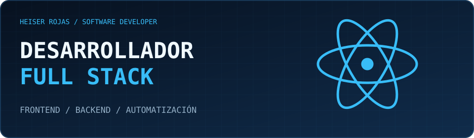
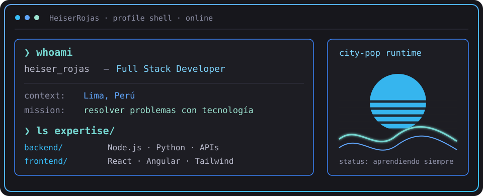
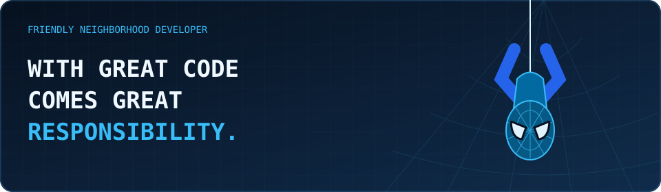
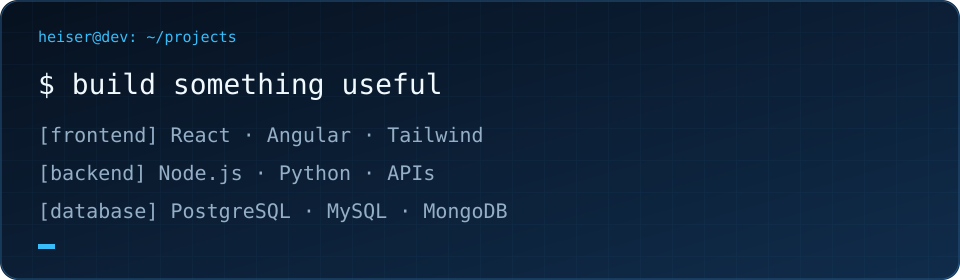
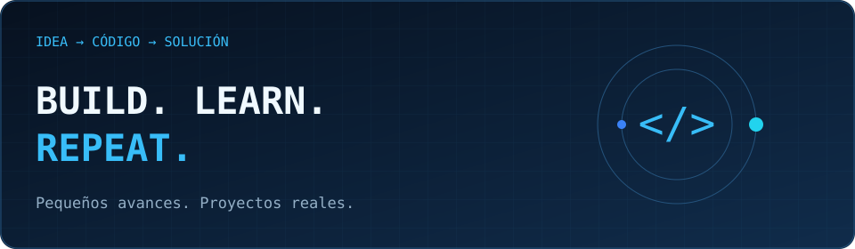
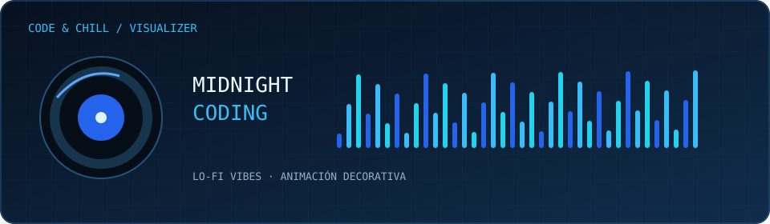
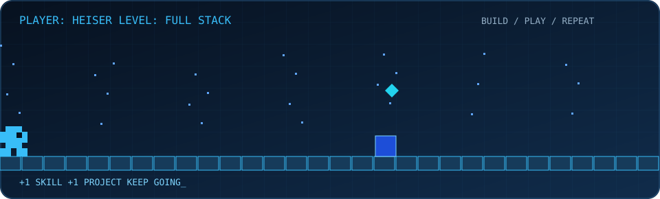
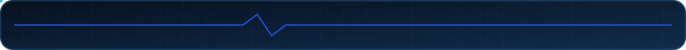

<div align="center">
<p align="center">
  
</p>

  <h2 align="center"></h2>

</div>

<div align="center">


<a href="https://github.com/HeiserRojas">
<picture>
  <source media="(prefers-color-scheme: dark)" srcset="banner-dark.svg">
  <source media="(prefers-color-scheme: light)" srcset="banner-light.svg">
  
</picture>
</a>


</div>

---

## `$ whoami`

<p align="center"></p>

Soy **Heiser Jeferson Rojas Burgos**, desarrollador full stack. Me gusta crear herramientas que resuelvan problemas reales: aplicaciones web, integraciones y automatizaciones que faciliten el trabajo de las personas.

He trabajado en control de asistencia con geolocalización y cámara, traducción de texto y audio e integraciones con WATI y FunnelChat. Continúo aprendiendo sobre cloud y DevOps mientras desarrollo proyectos.

## `$ cat tech-stack.yaml`

Tecnologías que he utilizado en trabajo, proyectos o aprendizaje; no todas representan el mismo nivel de dominio.
<table align="center" width="100%">
  <tr>
    <th colspan="2" align="left">
      <code>HeiserRojas:~$ cat tech-stack.yaml</code>
    </th>
  </tr>

  <tr>
    <th width="22%" align="left">🎨 Frontend</th>
    <td>
      
      <br>
      <sub>HTML · CSS · JavaScript · TypeScript · React · Angular · Tailwind CSS · Bootstrap</sub>
    </td>
  </tr>

  <tr>
    <th align="left">⚙️ Backend</th>
    <td>
      
      <br>
      <sub>Node.js · Express · Flask · Django · Spring · .NET · PHP · Laravel</sub>
    </td>
  </tr>

  <tr>
    <th align="left">💻 Otros lenguajes</th>
    <td>
      
      &nbsp;
      
      &nbsp;
      
      <br>
      <sub>Python · Java · C · C++</sub>
    </td>
  </tr>

  <tr>
    <th align="left">📱 Desarrollo móvil</th>
    <td>
      
      <br>
      <sub>React Native · Expo</sub>
    </td>
  </tr>

  <tr>
    <th align="left">🗄️ Bases de datos y BaaS</th>
    <td>
      
      &nbsp;
      
      <br>
      <sub>MySQL · PostgreSQL · MongoDB · Supabase · Firebase · MariaDB</sub>
    </td>
  </tr>

  <tr>
    <th align="left">☁️ Cloud y contenedores</th>
    <td>
      
      &nbsp;
      
      <br>
      <sub>AWS · Docker — en aprendizaje</sub>
    </td>
  </tr>

  <tr>
    <th align="left">🐧 Sistemas y terminal</th>
    <td>
      
      <br>
      <sub>Linux — en aprendizaje · PowerShell · Bash</sub>
    </td>
  </tr>

  <tr>
    <th align="left">🔧 Herramientas de desarrollo</th>
    <td>
      
      &nbsp;
      
      &nbsp;
      
      <br>
      <sub>Git · GitHub · VS Code · NPM · Markdown</sub>
    </td>
  </tr>

  <tr>
    <th align="left">🔌 APIs</th>
    <td>
      
      &nbsp;
      
      <br>
      <sub>REST API · Postman</sub>
    </td>
  </tr>

  <tr>
    <th align="left">🖌️ Diseño y organización</th>
    <td>
      
      &nbsp;
      
      &nbsp;
      
      <br>
      <sub>Figma · Canva · Trello</sub>
    </td>
  </tr>

  <tr>
    <th align="left">🌐 CMS</th>
    <td>
      
      <br>
      <sub>WordPress</sub>
    </td>
  </tr>

  <tr>
    <th align="left">🤖 Hardware e IoT</th>
    <td>
      
      <br>
      <sub>Arduino</sub>
    </td>
  </tr>

  <tr>
    <td colspan="2" align="center">
      <code>status: learning &amp; building · location: Lima, Perú</code>
    </td>
  </tr>
</table>

## `$ ls projects/`

| Proyecto | Qué desarrollé |
| :--- | :--- |
| 📍 Control de asistencia | Registro con geolocalización y cámara. |
| 🌎 Traducción e integraciones | Flujos de texto y audio con WATI, FunnelChat, DeepL y ElevenLabs. |
| 🎥 Extensión de navegador | Grabación y envío de videos mediante una extensión y un servidor para FunnelChat. |
| ☎️ Telefonía IP | Proyecto con Asterisk en AWS EC2, extensiones PJSIP y Zoiper. |
| 🌱 Riego automatizado | Proyecto con Arduino y ESP32. |

## `$ cat learning.md`

```yaml
focus:
  - Desarrollo full stack y APIs
  - Automatización con Python y n8n
learning:
  - Docker, Linux y fundamentos de CI/CD
  - AWS y despliegue de aplicaciones
next_step: seguir creando proyectos útiles
```

---

## `$ connect --socials`

<div align="center">

<a href="https://www.linkedin.com/in/heiserjefersonrojasburgos"></a>
<a href="https://mi-perfil-five.vercel.app"></a>
<a href="https://github.com/HeiserRojas"></a>
<a href="mailto:heiser.rojas@upch.pe" target="_blank">
    
  </a>
  <a href="https://buymeacoffee.com/heiserrojar" target="_blank">
    
  </a>

<sub>Desde Lima, Perú · @HeiserRojas · construyendo y aprendiendo</sub>
<br>




## Estadísticas de GitHub

<div>
  <p align="center">
    <a href="https://github-readme-streak-stats.herokuapp.com">
      
    </a>
        <a href="https://github.com/vn7n24fzkq/github-profile-summary-cards">
      
    </a>
  







